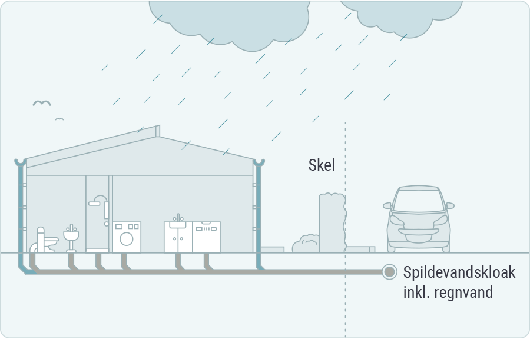
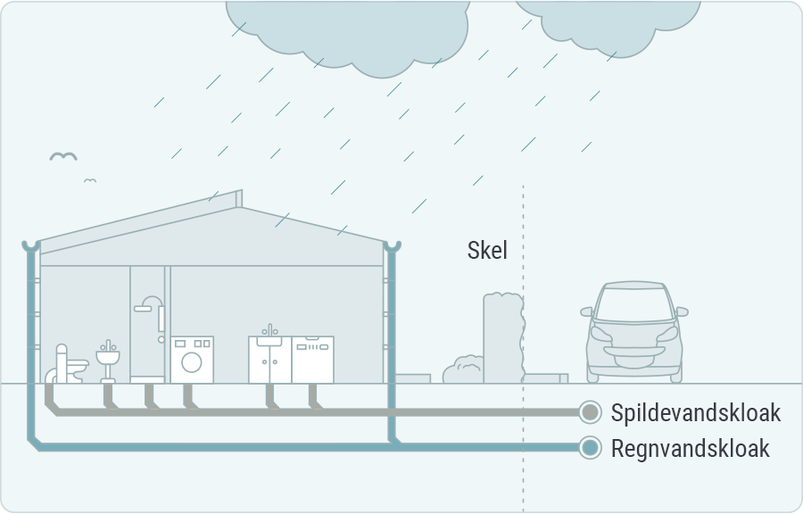
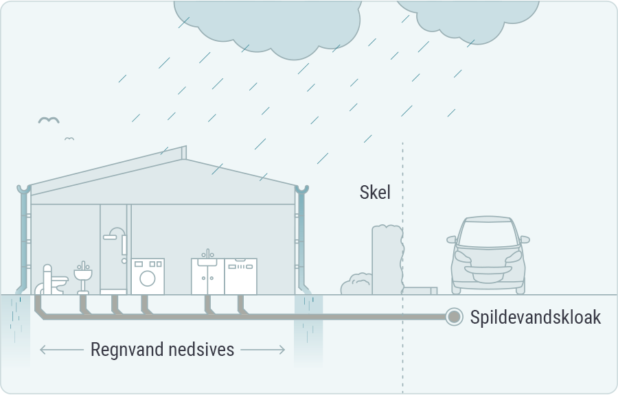

##Spildevandsanlæg - kloakeringsprincipper
###Fælleskloakerede områder
I disse områder er der kun én hovedkloakledning, der
modtager både tag- og overfladevand og spildevand. Her vil der kun være én stikledning til den enkelte ejendom. Der udføres ikke nye byggemodninger efter dette kloakeringsprincip.  

###Separatkloakerede områder
I de separatkloakerede områder vil der være to hovedkloakledninger. Én til spildevand og én til tag- og overfladevand. I disse områder vil der som regel være to stikledninger til den enkelte ejendom. Hvis ejendommen ikke har et regnvandsstik, skal tag- og overfladevand håndteres på egen grund. Grundejer har altid pligt til at aflede spildevand via spildevandsstikket, hvorimod der som regel kan gives tilladelse til at håndtere regnvand på egen grund. Grundejer er ansvarlig for, at tilslutningen er sket til de korrekte stikledninger.  

###Spildevandskloakerede områder
Disse områder bygger på separeringsprincippet, men i disse områder er der kun etableret én hovedkloakledning som afleder spildevand. Bortskaffelsen af tag- og overfladevandet fra området skal ske ved privat foranstaltning enten ved nedsivning eller ved udledning til recipient. Nedsivning og udledning kræver særskilt tilladelse.  

###Spildevands- og vejvandskloakerede områder
Disse områder bygger på separeringsprincippet, hvor der er én hovedkloakledning til spildevand og én ledning til vejvand. Vejvandssystemet er som regel ejet af kommunen eller grundejerforeningen. Bortskaffelsen af tag- og overfladevandet fra den enkelte ejendom skal ske ved privat foranstaltning enten ved nedsivning eller ved udledning til sø/vandløb. Nedsivning og udledning kræver særskilt tilladelse.
###Vejvandskloakeret
Enkelte vejstrækninger er etableret med et afløbssystem til håndtering af vejvand alene. Det er ikke tilladt at tilslutte/udlede spildevand eller tag- og overfladevand til disse anlæg.
